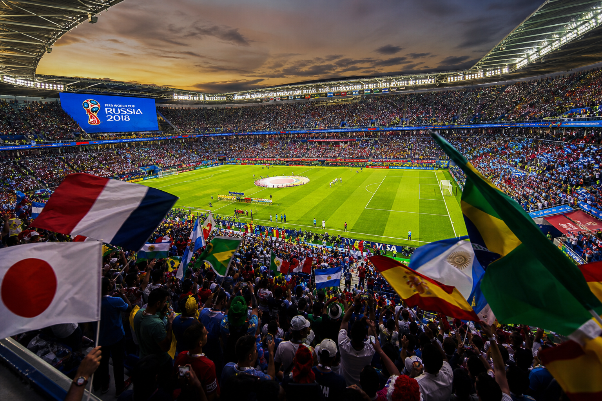
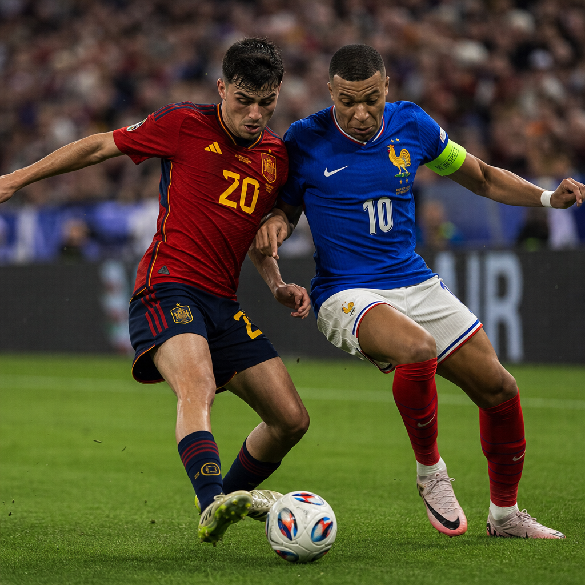

# מי תנצח את מונדיאל 2026? בין הסטטיסטיקה למגרש

מונדיאל 2026 כבר נכנס להיסטוריה עוד לפני שנקבע אלוף. זהו הטורניר הראשון שמתקיים בשלוש מדינות מארחות בו-זמנית - קנדה, ארצות הברית ומקסיקו - ובפורמט המורחב ביותר אי פעם, עם 48 נבחרות. אבל מעבר לגודל ולהיקף, מה שהופך את המהדורה הזו למרתקת במיוחד הוא הפער ההולך וגדל בין מה שהמספרים חזו לפני תחילת המשחקים, לבין מה שקורה בפועל על הדשא.

נכון לסוף יוני, הטורניר נמצא בשלב נוקאאוט מוקדם, אחרי שלב בתים שהספיק לטרוף את כל הקלפים: שתי נבחרות ענק הודחו בהפתעה גמורה, סוס אפל אחד מטפס בטירוף בדירוגים, ומדינה מארחת אחת מוכיחה שיתרון הבית הוא לא רק קלישאה.

## מי באמת מובילה עכשיו

לפי הדירוג העדכני של ESPN, שפורסם ב-28 ביוני לאחר תום שלב הבתים, התמונה ברורה: **צרפת** היא המועדפת המובהקת של הרגע. הנבחרת הצרפתית קיבלה 16 מתוך 20 קולות ראשונים בסקר המומחים - הובלה מוחצת. קילִיאן אמבפה ואוסמן דמבלה מובילים התקפה שנראית כמעט בלתי ניתנת לעצירה, והביצועים על המגרש פשוט מדברים בעד עצמם.

מי שלא מפתיע איש בשלב הזה היא **ארגנטינה**, האלופה המגנה. ליאו מסי כבש במשחק השביעי ברציפות שלו במונדיאלים - רצף שמדגים שגם בגיל הזה הוא עדיין הגורם המכריע. הארגנטינאים אפילו הרשו לעצמם לנוח עם הרכב חלופי מול ירדן, סימן לביטחון עצמי של נבחרת שכבר הוכיחה את עצמה.

**ספרד**, לעומת זאת, ממוקמת רק שלישית למרות שסיימה ראשונה בבית שלה. הביצועים תוארו כ"מאומצים", והנבחרת עדיין מחפשת את הנוסחה הנכונה סביב הכוכב הצעיר לאמין יאמל. זהו פער מעניין - כי מבחינה סטטיסטית טהורה, ספרד היא דווקא המועמדת המובילה לזכייה הכוללת.

## הניגוד המרכזי: מה שהמספרים אמרו לעומת מה שקורה במגרש

עוד לפני שהכדור התגלגל, חברת הנתונים Opta הריצה לא פחות מ-25,000 סימולציות מלאות של הטורניר, כדי לחשב את ההסתברויות הסטטיסטיות לזכייה באליפות. התוצאה הציבה את **ספרד** בראש עם 16.1% סיכוי לנצח, כשצרפת נמצאת אחריה עם 13.0%, ולאחר מכן אנגליה (11.2%) וארגנטינה (10.4%).

הנתון הבולט ביותר: ספרד הייתה הנבחרת היחידה שדורגה עם סיכוי גבוה מ-50% להגיע לרבע הגמר (52.1%), והגיעה לגמר ב-25.6% מהסימולציות - יותר מכל נבחרת אחרת. אנגליה לא רחוקה מאחור, עם 47.7% סיכוי לרבע הגמר, ומציגה בפועל שלב מוקדמות נקי מהפסדים ועם שמונה שערים נקיים.

זה בדיוק מה שהופך את המונדיאל הזה למרתק: התחזית הסטטיסטית טרום-טורניר מצביעה על ספרד, אבל הביצועים בפועל אחרי שלב הבתים מצביעים על צרפת. השאלה שתעסיק את כולם בשבועות הקרובים היא איזו משתי הגרסאות תנצח בסוף - המודל המתמטי, או המומנטום האמיתי על הדשא.

## ההפתעות שטרפו את הקלפים

אי אפשר לדבר על מונדיאל 2026 בלי לעצור רגע על ההדחות שזעזעו את הטורניר. **גרמניה**, ענקית כדורגל מסורתית, הודחה אחרי הפסד 2-1 לפרגוואי - וזאת אחרי שכבר הפסידה 2-1 לאקוודור בשלב הבתים עצמו. הבעיה ההגנתית הגרמנית הייתה ברורה מההתחלה, והתיאור שמלווה אותה בדירוגים - "נראית מצוין כשהדברים הולכים לטובתה" - הוא בעצם דרך עדינה לומר שכשהדברים לא הולכים לטובתה, היא קורסת.

**הולנד** הודחה גם היא, במפתיע, אחרי הפסד למרוקו - נבחרת שדווקא ממשיכה לטפס ולהפתיע, עם שתי דרגות עלייה בדירוג והתקפה שמראה פוטנציאל אמיתי.

אבל הסיפור המעניין ביותר של הטורניר עד כה הוא **קולומביה**. הנבחרת הדרום-אמריקאית קפצה חמש דרגות בדירוג - הטיפוס החד ביותר של כל נבחרת - והפכה ל"מועמדת ההפתעה הגדולה ביותר" הודות לעבודה הגנתית אפקטיבית ומשמעתית. זו הדוגמה הקלאסית לסוס האפל שאף אחד לא תכנן עליו, אבל כולם מתחילים לדבר עליו.

## זווית מארחות: מקסיקו המוערכת בחסר

לא ניתן להתעלם גם מהזווית של הנבחרות המארחות. **מקסיקו** סיימה שלב בתים מושלם, שלוש ניצחונות משלושה משחקים, ובכל זאת ממשיכה להיות מתוארת כ"מוערכת בחסר" בדירוגים הבינלאומיים. יתרון הבית, עם קהל אדיר התומך בכל משחק, מוכיח את עצמו כגורם משמעותי הרבה מעבר למה שמודלים סטטיסטיים יודעים לכמת.

**ארה"ב**, המארחת השנייה, חוותה את הסיפור ההפוך - איבדה מהמומנטום שלה אחרי הפסד עם הרכב חלופי לטורקיה, אם כי כריסטיאן פוליסיץ' עדיין שומר על קצב טוב אישית.

## הנקודה ההיסטורית שמרחפת מעל ארגנטינה

יש נתון אחד שכדאי לזכור כשחושבים על הסיכויים של ארגנטינה להגן על התואר: אף נבחרת לא הצליחה להגן בהצלחה על תואר אלופת העולם מאז ברזיל, רחוק בשנת 1962. זוהי "קללה" שמלווה כל אלופה מגנה כבר יותר משישים שנה, וגם נבחרות ענק עם שחקני על לא הצליחו לשבור אותה.

מבחינה סטטיסטית, ארגנטינה הייתה המועמדת המובילה לנצח בבית שלה (78.3% מהסימולציות) והגיעה לגמר ב-18.1% מהן - מספרים מרשימים בפני עצמם. אבל ההיסטוריה עומדת בניגוד ישיר לנתונים האלה, ומציבה בפני מסי ושות' אתגר שהוא הרבה יותר גדול מכל יריבה בודדת: לנצח את הסטטיסטיקה ההיסטורית עצמה.

## אז מי באמת תנצח?

האמת היא שאף אחד לא יודע - וזה בדיוק מה שהופך את הימים הקרובים למרתקים כל כך. יש לנו מודל סטטיסטי מתוחכם שמצביע על ספרד, יש לנו ביצועים בפועל שמצביעים על צרפת, יש לנו אלופה מגנה עם נקודת אל-חזור היסטורית, ויש לנו לפחות שלוש נבחרות הפתעה - קולומביה, מרוקו ומקסיקו - שמוכיחות שהן יכולות לקלקל את התחזיות לכל אחד מהמועמדים הגדולים.

מה שבטוח הוא שמתוך 47 נבחרות שזכו בניצחון לפחות באחת מ-25,000 הסימולציות שהריצה Opta, רק נבחרת אחת - קוראסאו - לא ניצחה באף סימולציה. כלומר, מבחינה תיאורטית טהורה, כמעט לכל נבחרת בטורניר יש סיכוי, ולו קטן, להרים את הגביע. עכשיו זה רק עניין של לראות איך המציאות על המגרש תכריע בין כל האפשרויות הללו.
